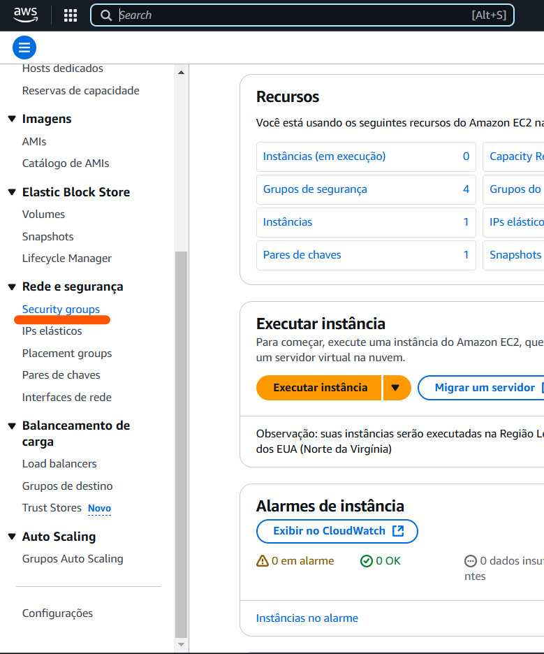
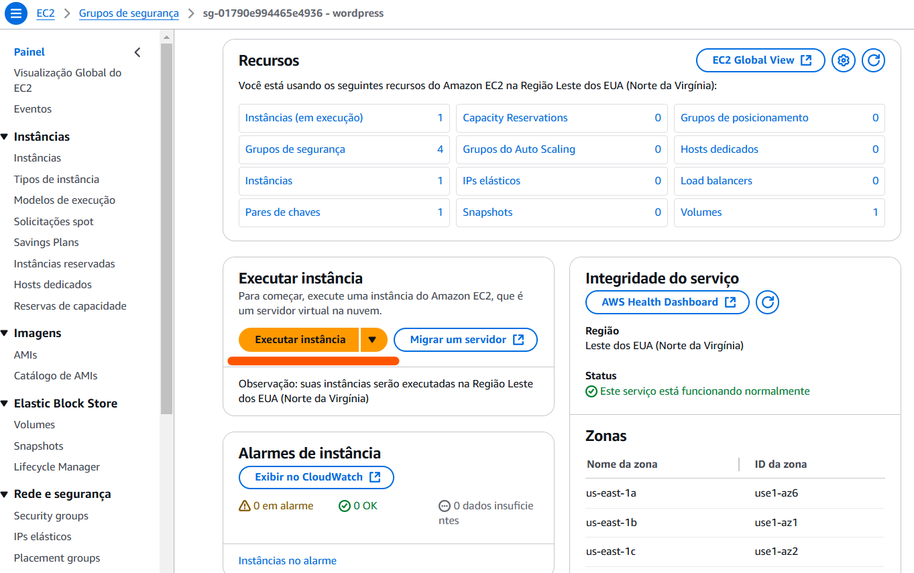
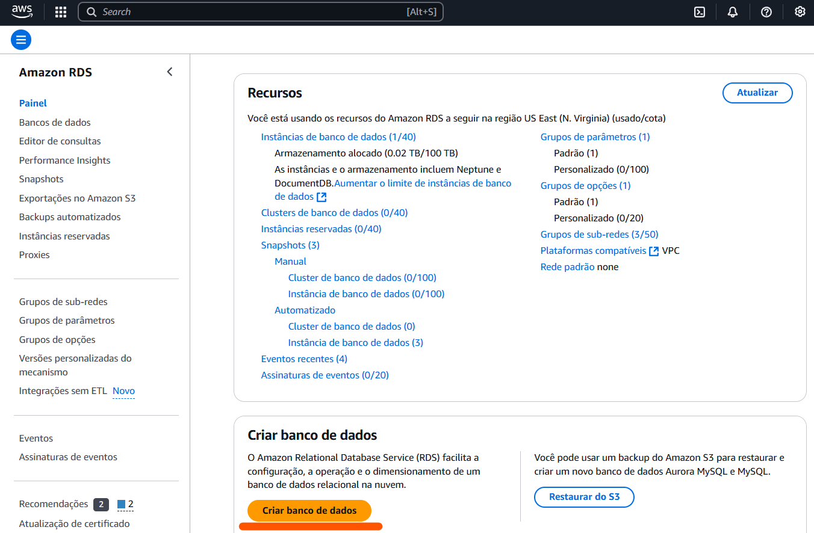
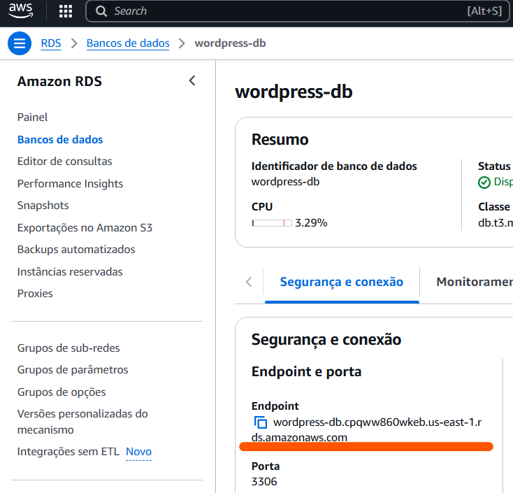

# Aplicação Wordpress com Banco de Dados MySQL com Docker

Esse projeto organizado no Programa de Bolsas da Compass UOL tem como objetivo subir uma aplicação Wordpress com um Banco de Dados MySQL com Docker.

# Índice

Se encontre no passo a passo para se guiar!

- [Detalhes da Atividade](#detalhes-da-atividade)
- [Segurity Group](#segurity-group)
- [EC2](#ec2)
- [Banco de Dados RDS](#banco-de-dados-rds)

<!-- - [](#) -->

# Detalhes da Atividade

Precisamos subir um container com Docker do Wordpress e fazer este se conectar com o Banco de Dados RDS da AWS. Além disso, precisamos configurar o uso do serviço EFS AWS para armazenar arquivos estáticos do container e também configurar o LoadBalancer para distribuir o tráfego do container Wordpress. Por fim, automatizar tudo com um arquivo `user_data.sh`

# Security Group

Um *Security Group* (Grupo de Segurança) é um conjunto de regras de segurança que controlam o tráfego de rede para uma instância EC2 ou outros recursos da AWS, permitindo ou bloqueando o acesso a determinadas portas e protocolos.
Logo, antes de criarmos as instâncias, temos que criar um grupo de securança para eles.

<div align="center">
    
</div>

## Configuração do Security Group

- **Nome do grupo de segurança**: wordpress-sg
- **Descrição**: Wordpress EC2 instance Security Group
- **Regras de entrada**:

| TIPO          | Intervalo de Portas | Origem        |
|:-------------:|:-------------------:|:-------------:|
| HTTP          | 80                  | 0.0.0.0/0     |
| SSH           | 22                  | 0.0.0.0/0     |
| MYSQL/Aurora  | 3306                | 172.31.0.0/16 |
| NFS           | 2049                | 172.31.0.0/16 |

+ **HTTP** -> Permite o acesso ao site Wordpress
+ **SSH** -> Permite o acesso remoto à instância EC2
+ **MYSQL/Aurora** -> Permite a conexão com o Banco de Dados RDS
+ **NFS** -> Permitir o acesso ao serviço EFS AWS para armazenar arquivos estáticos.

# EC2

Uma instância EC2 é uma máquina virtual na nuvem da AWS que pode ser configurada e personalizada para atender às necessidades específicas de uma aplicação ou serviço.

<div align="center">
    
</div>

## Configuração da EC2

- **Nome e Tags**: Fornecidas pela Compass para realização do Projeto
- **Imagem**: Ubuntu Server 24.04 LTS (HVM)
- **Tipo de Instância**: t2.micro
- **Atribuir IP público automaticamente**: Habilitar
- **Tipo de chaves SSH**: ED25519 (é necessário criar um Par de Chaves para acesso SSH)
- **Segurança do Grupo**: wordpress-sg (selecionar o [Security Group](#security-group))
- **Armazenamento**: 1x 8 Gib gp2

# Banco de Dados RDS

O Banco de Dados RDS (*Relational Database Service*) é um serviço da AWS que permite criar e gerenciar bancos de dados relacionais na nuvem, oferecendo escalabilidade, segurança e alta disponibilidade.

<div align="center">
    
</div>

## Configuração do RDS

- **Tipo de mecanismo**: MySQL
- **Versão do MySQL**: 8.0.39
- **Modelo**: Nível gratuito
- **Identificador da instância do banco de dados**: wordpress-db
- **Nome do usuário principal**: admin 🔄
- **Senha principal**: ####### 🔄
- **Configuração da instância**: db.t3.micro
- **Armazenamento**: SSD de uso geral (gp2) / 20 GiB
- **Recurso de Computação**: Conectar-se a um recurso de computação do EC2 (selecionar a [instância EC2](#ec2))
- **Grupo de segurança de VPC adicional**: wordpress-sg (selecionar o [Security Group](#security-group))
- **Configuração adicional > Nome do banco de dados inicial**: wordpressdb 🔄

⚠ Os itens com 🔄 serão reutilizados mais tarde. Anote eles!

# Remover Grupos Adicionais

Nessa última etapa, configuramos o RDS para conectar à instância EC2. Ao fazer isso, a AWS automaticamente cria dois grupos de segurança, um para o RDS e outro para a instância EC2. Estes não vão impactar, mas como já foi definido uma regra de entrada para MySQL no [Security Group criado anteriormente](#security-group), optei por deletar esses que a AWS criou. Basta ir na página dos Security Groups, selecionar esses dois grupos, remover as Regras de Entrada e Saída de ambos (um de cada vez) e depois deletá-los.

# Subir o container Wordpress

Após aguardar as instâncias inicializarem, é hora de colocar o Docker pra funcionar e fazer a conexão com o Banco de Dados.

## 1. Conecte-se na sua instância EC2

Usando o par de chaves SSH, vá até o diretório onde o arquivo `.pem` está localizado e use o seguinte comando:

```bash
ssh -i nome-do-arquivo.pem ubuntu@ipv4-publico-da-instancia-ec2
```

## 2. Instale as dependências

Neste repositório, tem o arquivo [user_data.sh](./user_data.sh) no qual vai ser usado para automaticamente instalar e configurar o Docker para utilização. Crie o arquivo na instância e coloque o código nele, executando-o logo em seguida.

```bash
chmod 700 user_data.sh
./user_data.sh
```

⚠ *Após isso, saia do SSH e conecte novamente para utilizar o docker sem o sudo.*

## 3. Inicie o container Wordpress

Agora vamos subir o container do Wordpress e acessar a aplicação.
Crie o arquivo [docker-compose.yaml](./docker-compose.yml) e insira o código nele. Porém, aqui há alguns detalhes:

```yaml
WORDPRESS_DB_HOST: <rds-endpoint>
WORDPRESS_DB_USER: <database-main-user>
WORDPRESS_DB_PASSWORD: <database-password>
WORDPRESS_DB_NAME: <database-name>
```

Esses três últimos parâmetros, você vai inserir os valores que foi pedido para ser reutilizado, durante a criação do RDS. Quanto ao `WORDPRESS_DB_HOST`, você vai na página do RDS, clique no identificador do [banco de dados que foi criado anteriormente](#banco-de-dados-rds) e procure por **Endpoint e porta**.

<div align="center">
    
</div>

Copie o **Endpoint**, coloque no [docker-compose.yaml](./docker-compose.yml) no parâmetro `WORDPRESS_DB_HOST` e salve o arquivo.
Agora vamos utilizar o `docker compose` para subir a aplicação e acessá-la no nosso navegador.

```bash
docker compose up -d
```

Se tudo ocorrer bem, o docker vai puxar a imagem do Wordpress e vai subir ela na porta 80, conforme mostrado no arquivo.

# Testando o Wordpress

Agora vamos torcer para tudo dar certo! Vá para seu navegador e insira o link:

```
http://ipv4-publico-da-instancia-ec2:80
```
